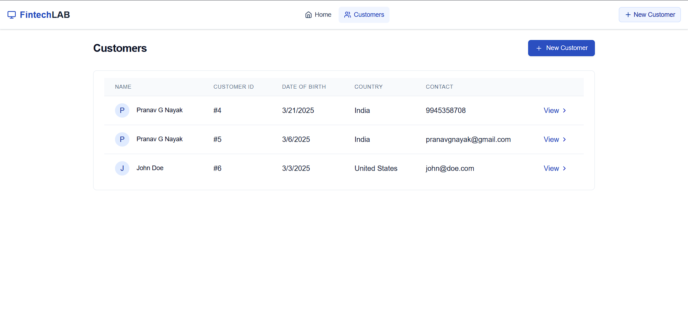
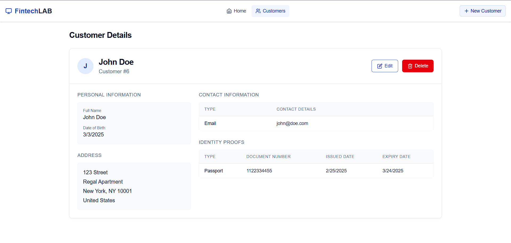

# Customer Management System - Project Report

## Table of Contents

1. [Introduction](#introduction)
2. [System Architecture](#system-architecture)
3. [Frontend Implementation](#frontend-implementation)
4. [User Interface Design](#user-interface-design)
5. [API Integration](#api-integration)
6. [Testing Results](#testing-results)
7. [Conclusion](#conclusion)

## Introduction

This project implements a Customer Management System with a modern React frontend and RESTful API backend. The application enables businesses to efficiently manage customer data through an intuitive user interface, supporting operations for creating, reading, updating, and deleting customer records.

The frontend is built using React with TypeScript for type safety, while the backend uses Spring Boot to provide RESTful APIs for data operations.

## System Architecture

The project follows a modern web application architecture with clear separation of concerns:

- **Frontend**: React with TypeScript using a component-based architecture
- **Backend**: Spring Boot REST API following MVC pattern
- **Styling**: Tailwind CSS for responsive and modern design
- **API Communication**: Fetch API for frontend-backend integration

### Technology Stack

- **Frontend**:
  - React 19
  - TypeScript
  - Tailwind CSS 4
  - React Router 7
  - React Hook Form
- **Backend**:
  - Java
  - Spring Boot
  - Spring Data JPA
  - RESTful API

## Frontend Implementation

The frontend implementation follows modern React practices with a component-based architecture and TypeScript for type safety.

### Key Features

#### Component Structure

- **Page Components**: Responsible for different views (home, customer list, customer details, forms)
- **Form Components**: Multi-step form for customer information entry
- **UI Components**: Reusable components like cards, buttons, and input fields
- **Layout Components**: Structure for consistent page layout

#### State Management

- React hooks for local component state
- Context API for shared state where necessary
- Form state management using React Hook Form

#### Routing

The application uses React Router for navigation between different views:

- Home page
- Customer listing
- Customer details view
- Customer creation form
- Customer edit form

## User Interface Design

The user interface is designed with a focus on usability and aesthetics, using Tailwind CSS for styling.

### Design Principles

- Clean, minimalist interface
- Consistent color scheme and typography
- Responsive design for all screen sizes
- Interactive components with appropriate feedback
- Form validation with user-friendly error messages

### UI Components

- Glass-effect cards for information display
- Custom styled form inputs
- Interactive buttons with hover effects
- Responsive navigation
- Modern data tables

## API Integration

The frontend communicates with the backend through RESTful APIs. The main endpoints used are:

| Method | Endpoint           | Description                  |
| ------ | ------------------ | ---------------------------- |
| GET    | /api/customer      | Retrieve all customers       |
| GET    | /api/customer/{id} | Retrieve a specific customer |
| POST   | /api/customer      | Create a new customer        |
| PUT    | /api/customer/{id} | Update an existing customer  |
| DELETE | /api/customer/{id} | Delete a customer            |

### Data Models

The TypeScript interfaces for data models ensure type safety when working with API data:

```typescript
export interface CustomerName {
  firstName: string;
  middleName: string;
  lastName: string;
}

export interface CustomerContactDetails {
  type: string;
  value: string;
  dialCode?: string;
}

export interface CustomerAddress {
  addressLine1: string;
  addressLine2?: string;
  city: string;
  state: string;
  country: string;
  zipCode: string;
}

export interface CustomerIdentityProof {
  type: string;
  value: string;
  issuedDate: string;
  expiryDate: string;
}

export interface Customer {
  id: number;
  name: CustomerName;
  dateOfBirth: string;
  contactDetails: CustomerContactDetails[];
  address: CustomerAddress;
  identityProofs: CustomerIdentityProof[];
}
```

## Testing Results

Comprehensive testing was performed to verify the functionality of all frontend features and their integration with backend APIs.

### 1. Homepage View

The application's landing page provides an overview of the system with navigation to key features.


_Figure 1: Application homepage with navigation options and overview_

### 2. Customer List View

The customer list view displays all registered customers with basic information and action buttons.


_Figure 2: Customer listing page showing all customer records with action buttons_

### 3. Customer Creation Form - Personal Information

The multi-step customer creation form starts with gathering personal information.


_Figure 3: First step of customer creation form - Personal information entry_

### 4. Customer Creation Form - Contact Details

The second step of the form collects contact information.


_Figure 4: Second step of customer creation form - Contact details entry_

### 5. Customer Creation Form - Address Information

This step captures the customer's address details.


_Figure 5: Third step of customer creation form - Address information entry_

### 6. Customer Creation Form - Identity Proofs

The final step collects identity document information.


_Figure 6: Fourth step of customer creation form - Identity proof information entry_

### 7. Customer Details View

The details view shows comprehensive information about a specific customer.


_Figure 7: Customer details view showing comprehensive information about a selected customer_

### 8. Form Validation

The forms implement validation to ensure data quality and completeness.


_Figure 8: Form validation in action showing error messages for invalid inputs_

### 9. Customer Record Creation - API Response

The backend successfully processes customer creation requests and returns confirmation.


_Figure 9: API response after successful customer record creation_

### 10. Customer Record Retrieval - API Response

The API correctly returns customer data when requested.


_Figure 10: API response showing customer details retrieval_

### 11. Customer Record Update - API Response

Changes to customer records are properly processed and stored.


_Figure 11: API response after customer record update_

### 12. Customer Record Deletion - API Response

The system successfully processes deletion requests.


_Figure 12: API confirmation after customer record deletion_

### 13. Deletion Verification - API Response

After deletion, the customer record no longer appears in the database.


_Figure 13: API response confirming customer record has been removed_

## Conclusion

The Customer Management System frontend successfully implements a user-friendly interface for managing customer data. Key achievements include:

1. **Modern UI Design**: A clean, intuitive interface using Tailwind CSS for styling
2. **Type Safety**: TypeScript integration for robust code
3. **Form Validation**: Comprehensive validation for data integrity
4. **Responsive Design**: Adaptability to different screen sizes
5. **Seamless API Integration**: Smooth communication with backend services

The application demonstrates effective use of modern frontend technologies to create a responsive, user-friendly interface for business operations. The combination of React, TypeScript, and Tailwind CSS provides a maintainable and scalable frontend architecture.

Future enhancements could include:

- User authentication and role-based access control
- Advanced filtering and search capabilities
- Data visualization for customer analytics
- Dark mode theme support
- Offline functionality with service workers
