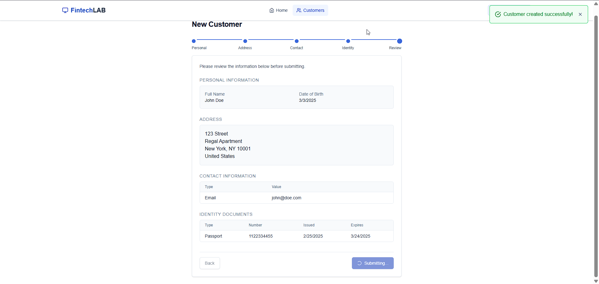

### Homepage

The homepage provides an overview of the application with navigation options to view all customers or create a new customer.

---

### Customer List

The customer list displays all registered customers with their basic details and actions to view, edit, or delete a customer.

---

### Customer Creation - Multi-Step Form

#### Step 1: Personal Information

The first step of the form collects the customer's personal details, including their name, gender, language and date of birth.

#### Step 2: Address Information

The second step captures the customer's address details, including city, state, and country.

#### Step 3: Contact Information

The third step collects the customer's contact details, such as email or phone number.

#### Step 4: Identity Proofs

The final step gathers identity document details, including type, document number, and validity dates.

#### Summary

Before submission, a summary page is shown, where the user can take a quick glance at the details they have entered.

---

### Customer Details View

The customer details page displays comprehensive information about a specific customer, including personal, address, contact, and identity details.

---

### Customer Deletion Confirmation

A confirmation dialog is displayed before deleting a customer to prevent accidental deletions.

---

### Error Handling

#### 404 Page

A user-friendly 404 page is shown when a requested page is not found.

#### Network Error

An error page is displayed when the customer list fails to load due to network or server issues.

